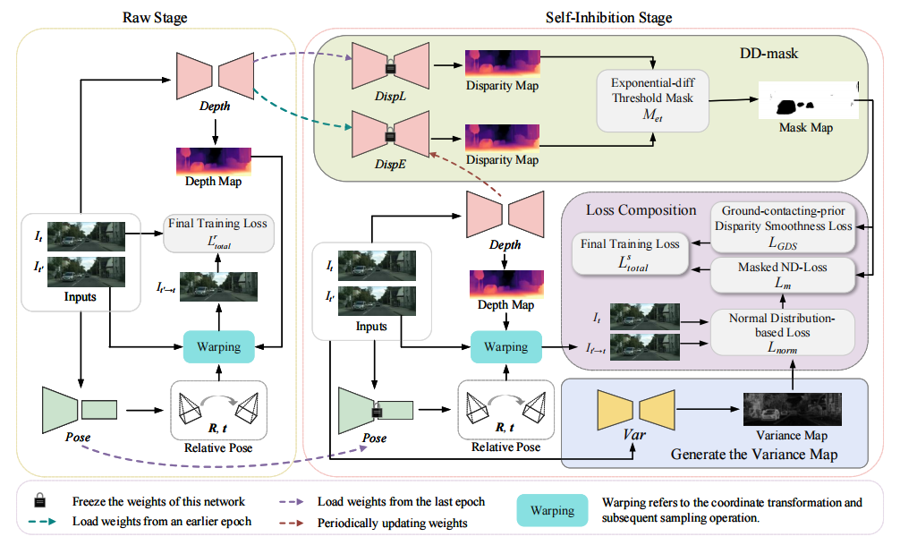

<h1 align="center">Depth Self-Inhibition: Enhancing Self-Supervised  Monocular Depth Estimation in Dynamic Scenes</h1>

## Demo Video
▶️ [Watch on YouTube](https://www.youtube.com/watch?v=<YouTube视频ID>)

## Results
You can download the trained models [here](https://drive.google.com/drive/folders/1q4eZ_rdRQwnVA9rVgeXuHZCrp1lzjBW5?usp=drive_link).
## Contact us
E-mail:zhangtian5552021@163.com
## Note
The complete training code will be made publicly available after the paper is accepted.
